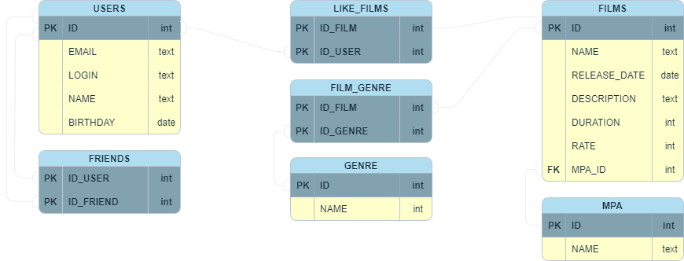

# Структура базы данных filmorate

## Описание базы данных

Список таблиц
***
1. [**USERS** список пользователей](#users)
2. [**FILMS** список фильмов](#films)
3. [**MPA** рейтинг Ассоциации кинокомпаний](#mpa)
4. [**GENRE** список жанров](#genre)
5. [**FRIENDS** статус «дружбы»](#friends)
6. [**LIKE_FILMS** таблица для связи фильмов и ползователей](#like_films)
7. [**FILM_GENRE** связ двух таблиц, film и genre](#film_genre)
***
### **USERS**

 
Содержит данные о пользователях.
 
Таблица включает такие поля:
> ***ID*** **(первичный ключ)** - идентификатор пользователя;
>
> ***EMAIL*** - электронная почта пользователя;
>
>***LOGIN*** - логин пользователя;
>
> ***NAME*** - имя пользователя;
>
> ***BIRTHDAY*** - дата рождения;
***
### **FILMS**

Содержит данные о фильмах.

Таблица включает такие поля:
> ***ID*** **(первичный ключ)** - идентификатор фильма;
>
> ***NAME*** - название;
>
> ***RELEASE_DATE*** - дата релиза;
>
> ***DESCRIPTION*** - описание;
>
> ***DURATION*** - продолжительность;
> 
> ***RATE*** - рейтинг фильма;
> 
> ***MPA_ID*** - рейтинг MPA;
***
### **MPA**
 
Рейтинг Ассоциации кинокомпаний (англ. Motion Picture Association, сокращённо МРА). Эта оценка определяет возрастное ограничение для фильма.
  
Таблица включает такие поля:
> ***ID*** **(первичный ключ)** - идентификатор mpa
>
> ***NAME*** - Значение оценки возрастного ограничения;
***
### ***GENRE***

Содержит список жанров.

Таблица включает такие поля:
> ***ID*** **(первичный ключ)** - идентификатор жанра;
>
> ***NAME*** - название жанра фильма;
***
### ***FRIENDS***
 
Статус для связи «дружба» между двумя пользователями.

Таблица включает такие поля:
> ***ID_USER*** **(ключ)** - идентификатор пользователя;
> 
> ***ID_FRIEND*** **(ключ)** - идентификатор друга;
***
### ***LIKE_FILMS***

Таблица для связи фильмов и пользователей который поставил лайк фильму.

Таблица включает такие поля:
> ***ID_FILM*** **(ключ)** - идентификатор фильма;
>
> ***ID_USER*** **(ключ)** - идентификатор пользователя;
***

### ***FILM_GENRE***

Таблица хранит данные о связи двух таблиц, фильмов и жанра фильма.

Таблица включает такие поля:
> ***ID_FILM*** **(ключ)** - идентификатор фильма;
>
> ***ID_GENRE*** **(ключ)** - идентификатор жанра;
***